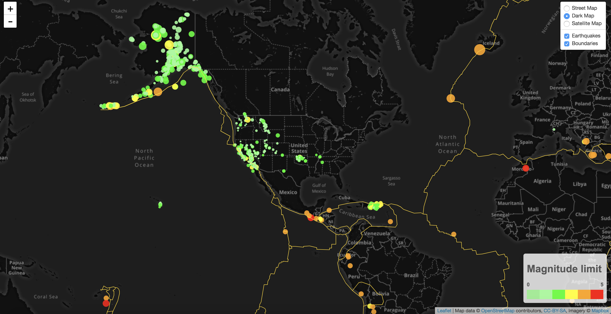

# Earthquake-visualization
* The USGS provides earthquake data in a number of different formats, updated every 5 minutes. Visit the [USGS GeoJSON Feed](http://earthquake.usgs.gov/earthquakes/feed/v1.0/geojson.php) page and pick a data set to visualize. You will be using the URL of this JSON to pull in the data for our visualization.

